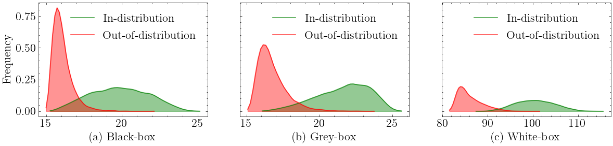

# IGEOOD: An Information Geometry Approach to Out-of-Distribution Detection

This repository is the official implementation of [IGEOOD: An Information Geometry Approach to Out-of-Distribution Detection](https://github.com/igeood/Igeood).


Figure 1. Probability distributions of the IGEOOD score under three different settings for a pre-trained DenseNet on CIFAR-10 for in-distribution and OOD data (Tiny-ImageNet downsampled).

## Installation instructions

To install requirements, run:

```setup
pip install -r requirements.txt
```

### (Optional) With Virtual environment

```python
python3 -m venv env
source env/bin/activate
pip install -r requirements.txt
```

## Preparation

Download out-of-distribution datasets:

### Out-of-distribution datasets

* **[Tiny-ImageNet (resize)](https://www.dropbox.com/s/kp3my3412u5k9rl/Imagenet_resize.tar.gz)**
* **[LSUN (resize)](https://www.dropbox.com/s/moqh2wh8696c3yl/LSUN_resize.tar.gz)** 
* **[iSUN](https://www.dropbox.com/s/ssz7qxfqae0cca5/iSUN.tar.gz)**
* **[Textures](https://www.robots.ox.ac.uk/~vgg/data/dtd/download/dtd-r1.0.1.tar.gz)**
* **[Places365](http://data.csail.mit.edu/places/places365/val_256.tar)**
* **[Chars](http://www.ee.surrey.ac.uk/CVSSP/demos/chars74k/EnglishImg.tgz)**

Here is an example code of downloading Tiny-ImageNet dataset. In the **root** directory, run

```shell
cd datasets
wget https://www.dropbox.com/s/kp3my3412u5k9rl/Imagenet_resize.tar.gz
tar -xvzf Imagenet_resize.tar.gz
cd ..
```

Alternatively, run the script `download.sh` to download all datasets to the `datasets/` folder.

```bash
bash download.sh
```

### In-distribution datasets

The in-distribution datasets CIFAR-10, CIFAR-100 and SVHN, are directly downloaded from PyTorch's official mirrors when called in code, i.e., `download` flag is set to `True` when loading these datasets.

### Pre-trained Models

The pre-trained models for reproducing results is available for download in the script `download.sh`. They will be downloaded to the folder `pre_trained/`.

```shell
# Models
mkdir pre_trained
cd pre_trained

# DenseNet-BC trained on CIFAR-10
wget https://www.dropbox.com/s/wr4kjintq1tmorr/densenet10.pth.tar.gz
tar -xvzf densenet10.pth.tar.gz
# DenseNet-BC trained on CIFAR-100
wget https://www.dropbox.com/s/vxuv11jjg8bw2v9/densenet100.pth.tar.gz
tar -xvzf densenet100.pth.tar.gz
# DenseNet-BC trained on SVHN
wget https://www.dropbox.com/s/9ol1h2tb3xjdpp1/densenet_svhn.pth

# ResNet34 trained on CIFAR-10
wget https://www.dropbox.com/s/ynidbn7n7ccadog/resnet_cifar10.pth
# ResNet34 trained on CIFAR-100
wget https://www.dropbox.com/s/yzfzf4bwqe4du6w/resnet_cifar100.pth
# ResNet34 trained on SVHN
wget https://www.dropbox.com/s/uvgpgy9pu7s9ps2/resnet_svhn.pth
```

## Evaluation

We provide a simple `cli` tool via the file `eval.py` to reproduce the main results of this paper.

For example, to run IGEOOD OOD detection method in a Black-Box setting on DenseNet trained on CIFAR-10 with Tiny-ImageNet as out-of-distribution dataset, run:

```shell
python eval.py igeoodlogits --nn densenet --in-dataset cifar10 --out-dataset Imagenet_resize --temperature 5.3 --epsilon 0 --gpu None
```

Refer to the documentation below for the `cli` tool.

```shell
python eval.py -h
usage: eval.py [-h] [-nn {densenet,resnet,densenet2}]
               [-i {CIFAR10,cifar10,CIFAR100,cifar100,SVHN,svhn}]
               [-o {Imagenet_resize,LSUN_resize,CIFAR10,CIFAR100,SVHN,iSUN,ADVdensenet10,ADVdensenet100,ADVdensenet_svhn,ADVresnet_cifar10,ADVresnet_cifar100,ADVresnet_svhn,Places365,Textures,Chars74K,gaussian_noise_dataset}]
               [-eps EPSILON] [-EPSS EPSILONS [EPSILONS ...]]
               [-T TEMPERATURE] [-TS TS [TS ...]] [-r REWRITE]
               [-b BATCH_SIZE] [-gpu GPU]
               {igeood_logits,igeoodlogits,igeood_plus,igeood_adv,igeood,igeood_adv_plus,msp,odin,energy,mahalanobis,mahalanobis_adv}

Reproduce results from IGEOOD: Information Geometry Approach to Out-
of-Distribution Detection paper.
...
example: python eval.py igeoodlogits -nn densenet10 -o Imagenet_resize
-eps 0.0012 -T 5.3 -gpu 0
```

The *core* implementation files of the OOD detection methods is in the folder `src/`.
